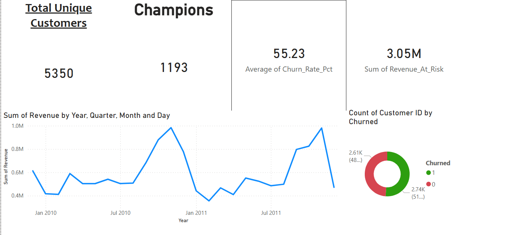
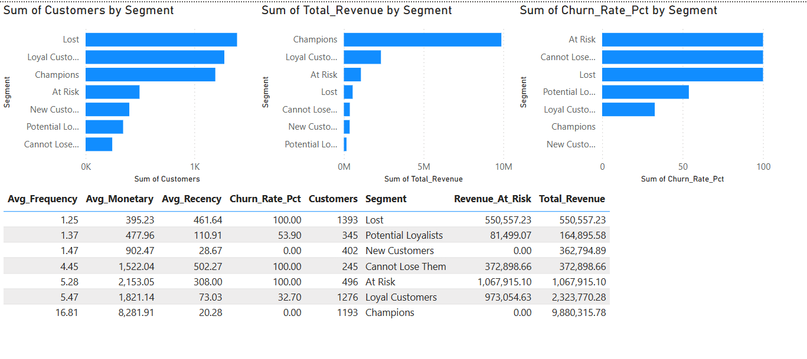

# 🛒 Customer Churn Prediction & Retention Analysis
### E-Commerce Retail Analytics | End-to-End Data Science Project


---

## 📌 Project Overview

E-commerce companies lose 20–30% of their customers every year — and most don't know who is about to leave until it's too late. This project builds a **full churn prediction pipeline** on real UK retail transaction data, combining RFM behavioral analysis, XGBoost machine learning, and an interactive Power BI dashboard to identify at-risk customers before they churn.

> **Bottom line:** Identified **£2,663,199 in revenue at risk** from high-risk customers across 5,350 unique customers — with a model ROC-AUC of **0.9821**.

---

## 📊 Key Results

| Metric | Value |
|--------|-------|
| Total Customers Analysed | 5,350 |
| Dataset Size | 725,250 transactions |
| Overall Churn Rate | 48.8% |
| Model ROC-AUC Score | **0.9821** |
| Revenue at Risk (High Risk) | **£2,663,199** |
| Active Customers | 51.2% |
| Churned Customers | 48.8% |

---

## 🗂️ Project Structure

```
customer-churn-analysis/
│
├── customer_churn_analysis.ipynb   ← Full analysis notebook
├── rfm_churn_data.csv              ← Customer-level RFM + churn scores
├── monthly_revenue.csv             ← Monthly revenue trend data
├── segment_summary.csv             ← Segment-level KPI summary
├── images/                         ← Charts and dashboard screenshots
└── README.md
```

---

## 🔄 Project Pipeline

```
Raw Transactions (1M+ rows)
        ↓
Data Cleaning & Preprocessing (725K rows)
        ↓
Exploratory Data Analysis (EDA)
        ↓
RFM Feature Engineering
        ↓
Customer Segmentation (8 segments)
        ↓
Churn Labeling (90-day threshold)
        ↓
XGBoost Model Training
        ↓
Export CSVs → Power BI Dashboard
```

---

## 🧠 Methodology

### 1. Data Cleaning
- Removed transactions with missing Customer IDs
- Filtered out cancelled orders (Invoice prefix 'C')
- Removed zero/negative quantity and price entries
- Focused on UK customers (largest market segment)
- Final clean dataset: **725,250 transactions**

### 2. RFM Feature Engineering
RFM is the gold standard segmentation model in retail analytics:

| Feature | Description |
|---------|-------------|
| **Recency (R)** | Days since last purchase — lower is better |
| **Frequency (F)** | Number of unique orders placed |
| **Monetary (M)** | Total spend across all transactions |

Each dimension was scored 1–5 using quintile binning, giving every customer an **RFM composite score**.

### 3. Customer Segmentation
Customers were grouped into **8 behavioral segments** based on RFM scores:

| Segment | Description |
|---------|-------------|
| 🏆 Champions | Bought recently, buy often, spend the most |
| 💚 Loyal Customers | Regular buyers with strong RFM scores |
| 🆕 New Customers | Bought recently but low frequency |
| 🌱 Potential Loyalists | Recent buyers with growth potential |
| ⚠️ At Risk | Used to buy often but haven't recently |
| 🚨 Cannot Lose Them | High value but going inactive |
| 💤 Hibernating | Low scores across all dimensions |
| ❌ Lost | Haven't purchased in a very long time |

### 4. Churn Labeling
A customer is defined as **churned** if they have not made a purchase in the last **90 days** of the dataset window. This is a standard retail industry threshold.

### 5. XGBoost Model
- **Features used:** Frequency, Monetary, F_Score, M_Score, RFM_Score
- Recency and R_Score were **intentionally excluded** to prevent data leakage (since churn is defined using recency)
- Class imbalance handled via `scale_pos_weight`
- Train/test split: 80/20 with stratification

**Model Performance:**
```
ROC-AUC Score: 0.9821

                 precision    recall  f1-score

      Active       0.93      0.89      0.91
     Churned       0.90      0.94      0.92
```

---

## 📈 Dashboard (Power BI)

The project includes a 2-page interactive Power BI dashboard:

**Page 1 — Executive Summary**
- KPI cards: Total Customers, Churn Rate, Revenue at Risk, Champions Count
- Monthly Revenue Trend (line chart)
- Active vs Churned split (donut chart)



**Page 2 — Customer Segments**
- Customers per segment (bar chart)
- Revenue per segment (bar chart)
- Churn rate by segment (bar chart)
- Full segment summary table



---


## 🛠️ Tech Stack

- **Python** — Pandas, NumPy, Matplotlib, Seaborn
- **Machine Learning** — XGBoost, Scikit-learn
- **Visualisation** — Power BI Desktop
- **Data** — UCI Online Retail II dataset (real UK e-commerce transactions)

---

## 📦 Dataset

**UCI Online Retail II Dataset**
- Source: [UCI Machine Learning Repository](https://archive.ics.uci.edu/ml/datasets/Online+Retail+II)
- Real transactional data from a UK-based online retailer
- Period: December 2009 – December 2011
- Size: 1M+ raw rows
---

## 🚀 How to Run

```bash
# 1. Clone the repo
git clone https://github.com/AtishayJain2102003/Customer-churn-analysis.git
cd customer-churn-analysis

# 2. Install dependencies
pip install pandas numpy matplotlib seaborn scikit-learn xgboost openpyxl

# 3. Download the dataset from UCI and place in project root

# 4. Run the notebook
jupyter notebook customer_churn_analysis.ipynb
```

